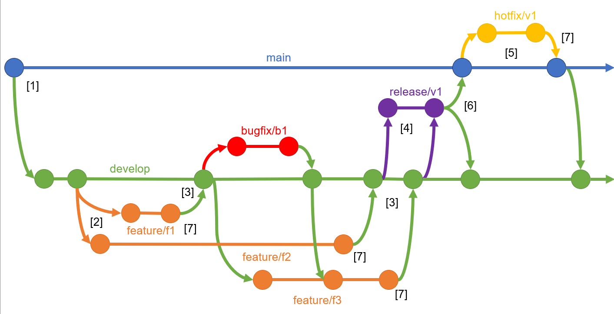

# Git Tutorial

This markdown file provides a detailed overview of Git, a widely-used version control system. It is essential for code management and collaborative software development.

## Table of Contents

- [Introduction](#introduction)
- [Standard Git Workflow](#standard-git-workflow)
- [Summary of Commands](#summary-of-commands)
  - [Basic Git Commands](#basic-git-commands)
  - [Config Commands](#config-commands)
  - [Working with Branches](#working-with-branches)
  - [Merging, Rebase and Conflicts](#merging-rebase-and-conflicts)
  - [Repository Inspection](#repository-inspection)
  - [Version Control Modification](#version-control-modification)
  - [Using Remote Repositories](#using-remote-repositories)
- [Branching Strategies](#branching-strategies)
- [Best Practices](#best-practices)
- [Visual Studio Code Extensions](#visual-studio-code-extensions)

## Introduction

- Git is a free and open source distributed version control system.
- Designed to track changes in files and coordinate work on those files among multiple people.
- Widely used in software development and in any projects involving file management.
- Designed to handle everything from small to very large projects with efficient and without interfering with each other.
- There are many platforms for hosting git repositories such as GitLab and GitHub.

### Key Features

**Version control**: Keeps a history of changes, allowing your to recert to previous versions.
**Collaborating**: Enables teams to work efficiently, even on large and complex projects.
**Branching**: Allows to experiment without affecting the main codebase and to work on multiple features simultaneously.
**Speed: Designed for performance even in large projects.
**Distributed nature**: Every developer has a full copy of the repository, improving reliability and flexibility.

### Key Terms in Git

**Repository**: A project folder tracked by Git.
**Remote Repository**: A Git repository hosted on a server, like GitLab.
**Commit**: A snapshot of changes saved to the repository.
**Branch**: An independent line of development.
**Merge**: Combining changes from one branch into another.

## Standard Git Workflow

### Clone or Create a Project

Option 1: Copy a remote repository to your local machine.

    git clone <repository-link>

Option 2: Initialize a local repository and link to a remote repository.

    git init
    git remote add origin <repository-link>

### Configure User Information

Before starting, verify and configure your Git user information. Adjust the global configuration if necessary, or set project-specific configuration:

    git config --list # Lists current Git configuration
    git config --global user.name "<your name>"
    git config --global user.email "<your email>"
    git config user.name "<project specific name>" # Set for current repository only
    git config user.email "<project specific email>" # Set for current repository only

### Select the right branch

Ensure you are working on the correct branch with these commands:

    git branch # Lists all branches
    git checkout (-b) <branch-name> # Switch to an existing branch or switch to a new one
    git pull origin <branch-name> # Pull latest changes for the branch from remote

### Track Changes and Commit

After modifying files or code, select the changes you want to include in the next commit and create the commit.

    git status # Shows the status
    git add <filename> # Add a specific file to the staging area
    git reset HEAD <filename> # Optionally, remove a file from the staging area
    git commit -m "<message>" # Create a local commit with a message

### Synchronize with Remote Repository: Push

Upload local commits to the remote repository.

    git push # Push local changes to the remote repository
    git push --set-upstream origin <branch-name> # For the first push in this branch

This step is typically followed by creating a merge or pull request in remote repository.

### Synchronize with Remote Repository: Pull

Fetch and merge changes from the remote repository:

    git pull origin <branch-name>

Repeat the steps from [Track Changes and Commit](#track-changes-and-commit) until the feature is completed or the task is done.

### Optional: Get Features of Other Branches into your Branch

To integrate changes from other branches into your branch, use:

    git fetch # Fetches all branches and their respective changes
    git merge origin/<target-branch> # Merge the specific branch into your current branch
    git push origin <your-branch-name> # Push merged changes to your branch on the remote

This is particularly useful when multiple team members' changes need to be consolidated or when major updates have been made to the main development branch since your last update.

## Summary of Commands

### Basic Git Commands

- `git init`: Initialize a local Git repository in your current directory
- `git add <file name>`: Add one or multiple files to the staging area
- `git commit -m <message>`: Commit your staged content as a new commit snapshot
- `git reset HEAD`: Remove all changes from the staging area
- `git reset HEAD <file>`: Remove a file from the staging area
- `git mv <original file> <new file>`: Move or rename a file and stage the change
- `git rm <file>`: Remove file from the working directory and stage the change

### Config Commands

- `git config --list`: List current Git configuration
- `git config --list --show-origin`: Show where different configuration settings are coming from
- `git config --global user.name`: Get global user name
- `git config -- global user.name <your name>`: Set global user name
- `git config user.name`: Get local user name (returns global if no local exist)
- `git config user.name <your name>`: Set local user name
- `git config --global user.email <your email>`: Set global user email
- `git config --global core.editor <editor>`: Set global text editor for merge and commit messages

### Working with Branches

- `git branch`: List local branches
- `git branch -m <old name> <new name>`: Rename a local branch
- `git branch -d <branch-name>`: Delete a branch
- `git checkout`: Switch from one branch to another
- `git checkout -b <branch-name>`: Create and switch to a new branch

### Merging, Rebase and Conflicts

- `git merge <branch>`: Merge the specified branch's history into the current one to combine changes
- `git rebase <branch>`: Reapply commits on top of another base. Alternative to merging that can help maintain a cleaner project history

Merging and rebasing can lead to conflicts. You will either need to resolve the conflict or to abort the merge/ rebase:

**Resolving**:

- When a conflict arises, Git will pause the process, allowing you to fix the conflicts manually.
- Confilcted files are marked in the project directory (or use `git status`).
- Conflicts are marked within the file with `<<<<<<<`, `=======` and `>>>>>>>` You can directly edit the files to fix inconsistencies.
- Once conflicts are resolved: Add the files and make a commit with `git commit`. Git will offer a pre-filled commit message realted to the merge.

**Aborting**:

- Aborting resets the branch to the state before the merge or rebase began.
- To abort a merge: `git merge --abort`
- To abort a rebase: `git rebase --abort`

Ensure you either resolve the conflicts or abort the merge/rebase process. Failing to do so can lead to a confusing git history and increase the risk of errors in future operations.

### Repository Inspection

- `git status`: Check the status of working directory and staging area
- `git log`: Display the entire commit history using the default format
- `git log --graph`: Displays the entire commit history using an ASCII graph
- `git diff`: Show changes between the working directory and the staging area
- `git diff <commit 1> <commit 2>`: Show differences between two commits
- `git show`: Show details of the last commit
- `git show <commit>`: Show details of a specific commit
- `git blame <file>`: Display the revision and author information line-by-line for a file

### Version Control Modification

These commands allow changes to the commit history of your Git repository. Use them carefully as they can alter the historical integrity of your project.

- `git commit --amend`: Modify the most recent commit, by either correcting the commit message or the applied changes
- `git revert <commit ID>`: Creates a new commit that reverses the effects of a previous commit
- `git reset --hard <commit ID>`: Reset current branch to the state of a certain commit and discard all changes in the working directory and staging area

### Using Remote Repositories

- `git clone <repository link>`: Copy a remote repository
- `git remote add <remote> <repository url>`: Link a local repository to a remote repository
- `git remote -v`: List remote repositories along with their URLs
- `git push`: Upload local repository content to the remote repository
- `git push --set-upstream <remote> <branch name>`: Set the default remote branch for pushes
- `git push --all`: Push all local branches to the remote repository
- `git push --force`: Forces the push, potentially overwriting any changes in the remote repository that cause conflicts
- `git pull`: Fetch and integrate changes from a remote repository to your local branch
- `git pull --rebase`: Reapply your local changes on top of fetched changes
- `git fetch origin <branch>`: Downloads data from a remote repository into the local branch, updating tracking branches without merging any changes

## Branching Strategies

A branching strategy is critical for managing parallel development streams, maintaining code quailty and facilitating continuous integration. Various strategies exist, tailoring to different team sizes and project workflows.

Most common strategies:

- **Feature Branch Workflow**: Each new feature is developed in its own branch, which is eventually merged back into the main branch upon completion. The main branch always contains production-ready code.
- **Gitflow Workflow**: Similar to Feature Branch. Involves two main branches with an infinite lifetime: master for production releases and develop for the next release development.
- **Forking Workflow**: Used in open-source projects. Contributors must fork the repository and make pull requests to contribute their changes.

### Gitflow Workflow Strategy

Purpose: The Gitflow Workflow organizes the development process by separating releases, features, and maintenance work. This seperation ensures that ongoing development can continue on features without disrupting the main production environment and eases managing multiple versions.

#### Lifecycle

1. **Initialization**: Initialize `main` and `develop` for releases and development.
2. **Feature Branches**: For each new feature, a branch is created from `develop`.
3. **Integration**: After a feature is finalized, the `feature branch` is merged back into the `develop` branch.
4. **Release Branches**: Once enough features have been developed, a `release branch` is created from `develop`, which will eventually become the next production release.
5. **Hotfix Branches**: If an issue is discovered in the `release` or `main branch`, a `hotfix branch` is created to address the problem directly.
6. **Integration**: `Release` branches are merged into both `develop` and `main` when they are ready to go live. Hotfix branches are also merged into both branches.
7. **Deletion**: After merging, `feature` and `hotfix` branches are often deleted.

#### Tips

- Use clear and descriptive names for branches to easily distinguish their purposes.
- Employ pull requests for merge changes and implement code reviews.
- Regularly update all branches with changes from the main or develop branches to minimize conflicts.

## Best Practices

- Commit often and with descriptive messages.
- Ensure commit messages are clear, written in English, and start with a capital letter.
- Phrase your commit messages to complete the sentence: "If you apply this commit, it will ..."
- Regularly integrate changes from the main branch into your feature branch to avoid conflicts.
- Push changes only after verifying they are correct and follow the established workflow.
- Keep feature branches focused on a single goal and short-lived.
- Be consistent with the established Git workflow and branching strategy.
- Use .gitignore files to maintain a clean repository.
- Ensure sensitive information like passwords, API keys, or private data is excluded from commits at all times!
- Reach out to teammater if unexpected behaviour or errors occur.

## Visual Studio Code Extensions

VS Code offers a range of extensions that enhance the Git experience, making version control more intuitive and visually engaging:

- **Git Graph**: A Useful extension for viewing your repository's history in a graphical interface. It allows you to visualize branch structures and commit histories with ease.
- **Git History**: Helps you explore and search through the commit history of files and branches. It provides a detailed log of changes, including diffs of what has changed in each commit.
- **Git Blame**: Essential for quickly identifying who made changes to any line of code. It displays author information directly in the editor, allowing you to understand code ownership and history at a glance.

---

For more detailed information, visit the [official Git documentation](https://git-scm.com/doc).
